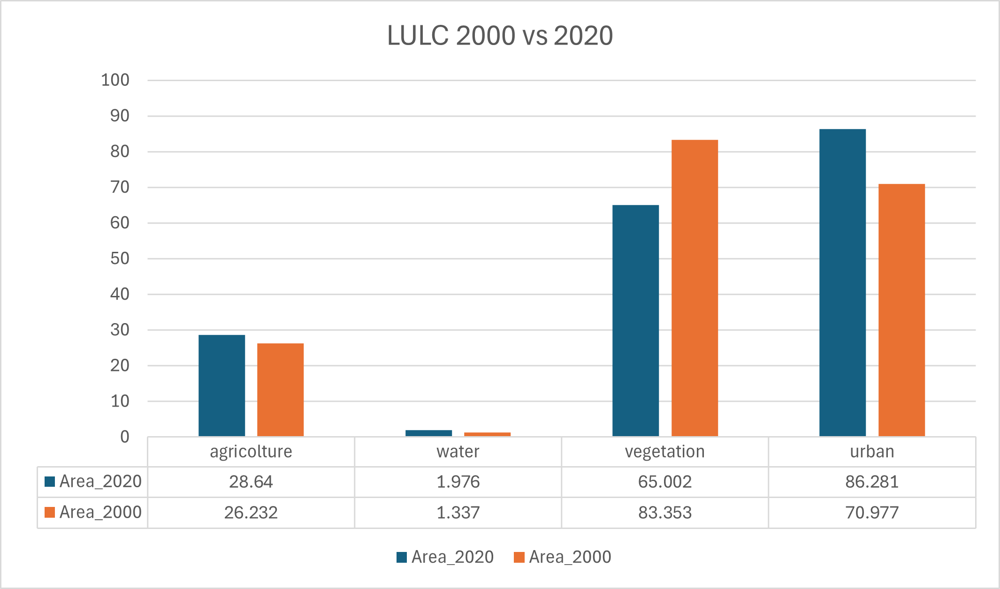
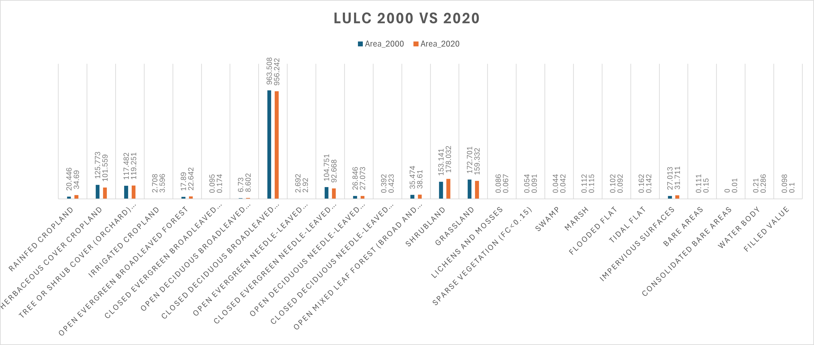

# Land-Use-Land-Cover-Analysis-GEE

Il progetto consiste nell'effettuare una LULC (Land Use Land Cover) change analysis, ossia analizzare come l'uso del suolo cambia nel tempo, in Google Earth Engine (GEE).

In particolare questa analisi viene effettuata in due zone diverse: una molto urbanizzata (MILANO) e una zona invece che preserva molto le zone verdi (PARCO NAZIONALE DEL CILENTO). Lo scopo quindi è quello di analizzare come l'uso del suolo è cambiato, facendo un paragone tra 2000 e 2020.

Il progetto è suddiviso in 2 fasi, la prima consiste nella classificazione del suolo ed è eseguito in GEE, mentre la seconda consiste nel prendere in input le mappe ottenute in output dalla prima fase ed analizzarle in QGIS per effettuare una land cover change analysis.

# FASE 1. Land Cover Classification in GEE

Questo progetto esegue la classificazione dell'uso del suolo utilizzando immagini satellitari Landsat di due periodi temporali: 2000 e 2020. La classificazione utilizza Google Earth Engine (GEE) per elaborare e classificare i dati satellitari con un classificatore Random Forest. L'obiettivo è classificare i tipi di copertura del suolo (ad esempio, urbano, acqua, vegetazione e agricoltura) e valutare i cambiamenti nel tempo.

## Step principali:

1. **Pre-elaborazione**:
   - **Mascheramento delle nuvole** utilizzando le bande QA per escludere le aree coperte da nuvole e ombre.
   - **Applicazione dei fattori di scala** alle bande ottiche e termiche Landsat per correzioni radiometriche.
   - **Calcolo degli indici spettrali** come NDVI, NDBI e GNDVI, che vengono utilizzati come features per il modello di classificazione.

2. **Preparazione del dataset**:
   - I dati Landsat 7 del 2000 e i dati Landsat 8 del 2020 sono filtrati in base alla copertura nuvolosa e alla regione di interesse (ROI).
   - Vengono aggiunti dati di elevazione e pendenza da un modello digitale di elevazione (DEM).
   - Viene utilizzata la mediane per ridurre l'intera collezione di immagini in una sola immagine.

3. **Addestramento e classificazione**:
   - I campioni di addestramento vengono raccolti dalla mappa (etichettatura manuale di urbano, acqua, vegetazione e agricoltura).
   - Un classificatore Random Forest viene addestrato su entrambi i dataset del 2020 e del 2000 utilizzando bande spettrali + NDVI, NDBI, GNDVI, elevazione e pendenza.
   - L'accuratezza del classificatore viene valutata utilizzando matrici di confusione, calcolando precisione, recall e statistiche kappa.

4. **Valutazione dell'accuratezza**:
   - I set di addestramento e validazione vengono valutati per fornire accuratezza complessiva, producer accuracy (recall), consumer accuracy (precisione) e statistiche kappa.
   - I risultati vengono esportati come file CSV e le mappe classificate vengono esportate come immagini.

## Output:

- Mappe di classificazione dell'uso del suolo per il 2000 e il 2020.
- Metriche di accuratezza per entrambi i periodi.

# FASE 2. Land Cover Change Analysis in QGIS
In questa seconda fase vengono utilizzati gli strumenti messi a disposizione da QGIS per effettuare un'analisi sui cambiamenti.

- Input: mappe LULC ottenute da GEE nel primo step
  
Vengono eseguiti i seguenti step per ciascuna mappa ottenuta dalla classificazione:

- step 1: Raster to vector - le mappe vengono convertite da un formato raster a un formato vettoriale per analisi successive
- step 2: Dissolve - viene utilizzato lo strumento dissolve per aggregare insieme tutte le aree della mappa appartenenti alla stessa classe
- step 3: Aggiunta campi "class" e "area" come attributi della mappa
- step 4: Calcolo area in km^2 per ogni classe tramite field calculator
- step 5: Intersect dei 2 vector files ottenuti per fare change detection
- step 6: Dallo step 5 otteniamo un nuovo file in cui aggiungiamo come attributo l'area di cambiamento in km^2 per ciascuna coppia di classi (es. urban-water, urban-agricolture, ecc... )
- step 7: Esportazione in excel e visualizzazione dei dati ottenuti dall'analisi

## Output:

*lulc change area Milano*

*lulc 2000 vs 2020 Milano*

*lulc 2000 vs 2020 Parco Nazionale del Cilento*
